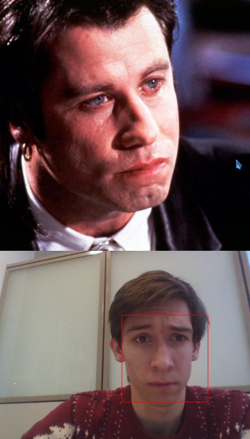
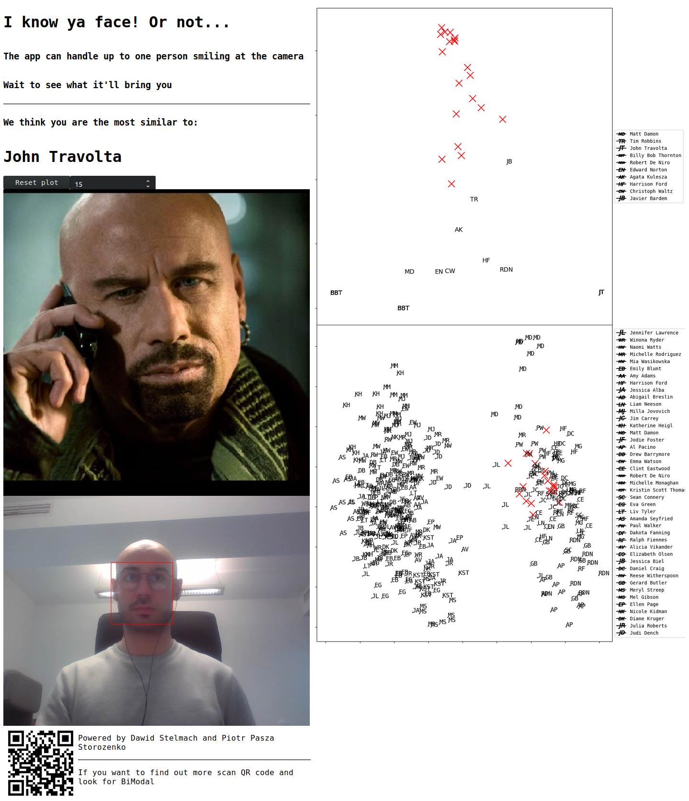
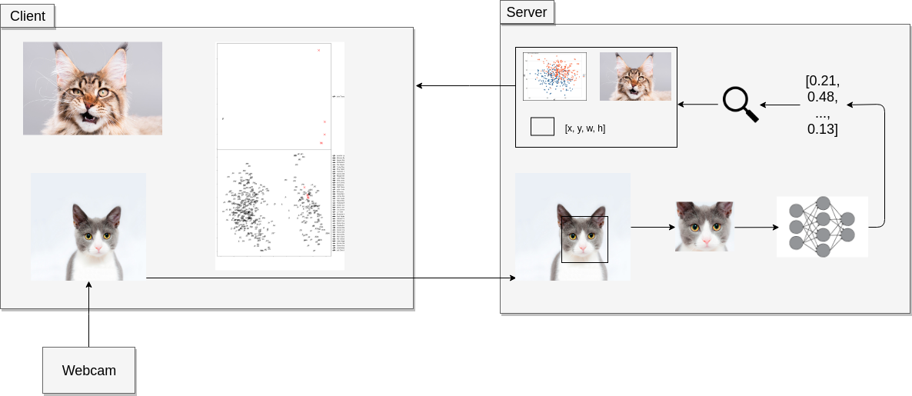
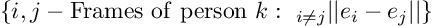
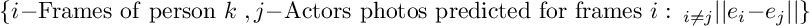
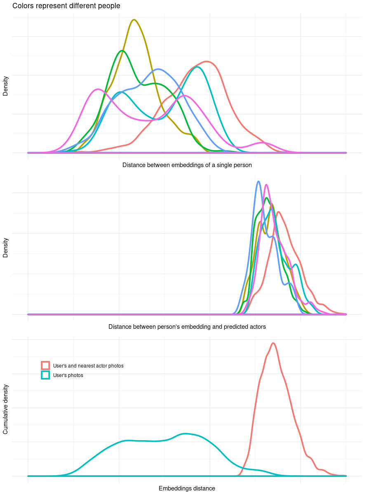
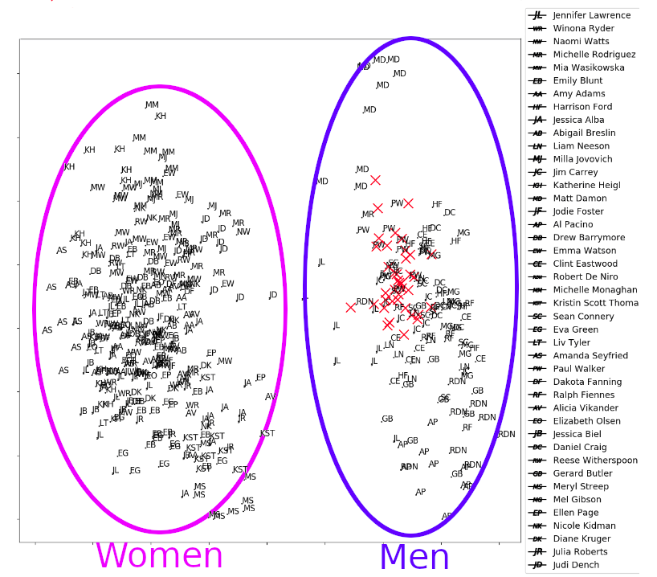

# Your face seems famous!

Have you ever thought which actor are you the most similar to? That's exactly what our app will tell you!



Table of Contents
=================

   * [Your face seems famous!](#your-face-seems-famous)
   * [Installation](#installation)
   * [Usage](#usage)
   * [Technical info](#technical-info)
      * [Performance](#performance)
      * [Stability issues](#stability-issues)
      * [Visualizing the results](#visualizing-the-results)
   * [Experiment](#experiment)
      * [What we want to check?](#what-we-want-to-check)
      * [How we've done it?](#how-weve-done-it)
      * [Results!](#results)
      * [Comments](#comments)
      * [Additional question](#additional-question)
   * [Conclusions](#conclusions)

# Installation

The app can be run locally on your own machine. Due to `face_recognition` package requirements macOS and Linux machines are supported, however you can try [this](https://github.com/ageitgey/face_recognition/issues/175#issue-257710508) on Windows.

Local requirements:

- Python >= 3.6
- [dlib](http://dlib.net/)
- numpy==1.15
- pandas==0.23.4
- Flask==1.0.2
- Flask-SocketIO==3.0.2
- Pillow==5.3.0
- eventlet==0.24.1
- face_recognition==1.2.3
- matplotlib==3.0.2
- scikit-learn==0.20.0

All needed Python packages are listed in `reqs.txt` file.

Since `dlib` and `face_recognition` [installation](https://github.com/ageitgey/face_recognition#installation) can be problematic in some cases, we highly recommend using Docker containers. `Dockerfile` as well as `docker-compose` files can be found in the `docker` directory.

To run application via Docker go to the `Docker` directory and run in the console:

```docker-compose up```

For more details visit [Docker documentation](https://docs.docker.com/get-started/)

By default app is available under `http://localhost:6113`

# Usage



After reaching proper URL, give the app permissions to your webcam. All you have to do now is to wait to see the results.

On the bottom left webcam stream will be displayed with most similar actor's image and name above it. On the right there will be plot showing position of current embedding of captured face (with respect to the average). Bottom plot shows general view, while top plot shows closer view on yours face "neighbors".

On topmost left position there is "control center". The number in the box determines number of webcam frames that are averaged while searching the most similar actor's photo. By clicking the `Reset` button you can reset plot and averaging process.

If no or more than one faces are detected no result will be displayed. After 15 consequent frames with no result, plot and averaging resets automatically.

# Technical info

Our application is a web app with client server architecture and communication over web sockets.

Client side is responsible only for capturing frames from webcam stream which is then send to the server, displaying results and controlling some runtime parameters. We've used standard, plain HTML/CSS/JS stack alongside with [socket.io](https://socket.io/) library.  

All computation is done at the server side. Server is written in [Flask](http://flask.pocoo.org/) with help of [Flask-socketIO](https://flask-socketio.readthedocs.io/en/latest/) to allow communication over web sockets.



For face detection and encoding [face_recognition](https://github.com/ageitgey/face_recognition) package is used. Here we add a brief description of what is going on under the hood but for more (first hand) information about methods and models take a look at this [blog post](https://medium.com/@ageitgey/machine-learning-is-fun-part-4-modern-face-recognition-with-deep-learning-c3cffc121d78).

1. Face detection
   - convert picture to grayscale
   - compute HOG ([Histogram of Oriented Gradients](https://lear.inrialpes.fr/people/triggs/pubs/Dalal-cvpr05.pdf)) on the 16x16 grid
   - find HOG face pattern
2. Posing and Projecting Faces
   - compute 68 face [landmark points](http://www.csc.kth.se/~vahidk/papers/KazemiCVPR14.pdf)
   - find affine transformations to align photo to perfectly centered face pattern
3. Faces encoding
   - get pretrained neural network e.g. from [OpenFace](https://cmusatyalab.github.io/openface/) library
   - encode your faces from your database using this network
4. Finding the most similar face
   - train any classifier to classify faces from your database
   - classify new images

Faces are compared with precomputed representations of predefined set of **4062** images (**289** different actors) using KNN algorithm with n = 7 .

## Performance

`face_recognition` package is capable of finding the most similar photo on the fly, but in our application we have to take some performance aspects into account. Based on info provided by package creators we've decided to use [KNN classifier](https://github.com/ageitgey/face_recognition/blob/master/examples/face_recognition_knn.py) for that purpose.

## Stability issues

From the beginning of project stability of responses was the biggest concern.
Webcam images usually have poor quality which is highly dependent on light conditions.
What is more, photos used in the project are quite diverse even looking at a single actor.

During first tries, every response showed different person, even when we tried not to move our faces.
Due to the fact that the KNN algorithm is used to find the most similar actor, we've tried increasing the *k* parameter.
Unfortunately it didn't help a lot.

After that we've implemented averaging face embedding, which significantly improved stability.

## Visualizing the results

The embedding produced by `face_recognition` package is a **128** dimensional vector.
In order to investigate results we've decided to visualize this data after transforming with [PCA](https://en.wikipedia.org/wiki/Principal_component_analysis).
Algorithm was trained on all available photos, but only top 50 actors with the most photos are displayed.
With more actors, plots are even more unreadable.

Plots show only first and second principal components.

Red crosses represent your photos.
At first glance it can be wierd that an algorithm returned not the nearest actor on a plot, but keep in mind that it's only projection of 128 dimensional space on 2D space.


# Experiment

## What we want to check?

After creating the app we decided to check how much distances (in embeddings space) of a single person differs compared to distances from person's actor's siblings.

It may help to answer why our predictions are unstable.

## How we've done it?

We recorded 5-20 seconds of 6 different people and cut it into frames.
For every person **k**, for every frame **e_i** we calculated distances (in embedding space) from every other frame **e_j** of the same person and distances between **e_i** and photos predicted for **e_j**.

To put it into equations:

First plot:



Second plot:



Third plot is a sum of two above.

## Results!



## Comments

Since the neural network was trained to find exact person, not the one the most similar it's easy to notice two things (regardless units and scale):

- photos of the same person can differ a lot. It is because we ask people not to be steady while recording as well as laptop camera gives quite noisy images.
- most of returned pictures of actors are in specific, narrow range.

## Additional question

One of the first things that can be seen is visible division of the photos into two clusters. After investigation it turns out that they are men and women (which is quite consistent).



# Conclusions

Network is able to spot subtle differences in faces, but what is more visible, works great in terms of distinguishing people!

# Other projects

This project was made during course *Case Studies* at *Warsaw University of Technology*.
If you want to check our friends projects, visit [Case Studies2019W](https://github.com/pbiecek/CaseStudies2019W)!